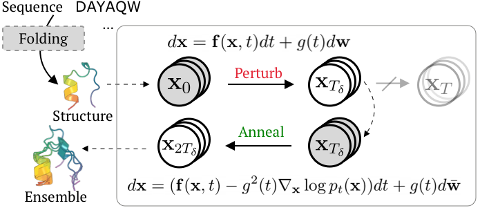
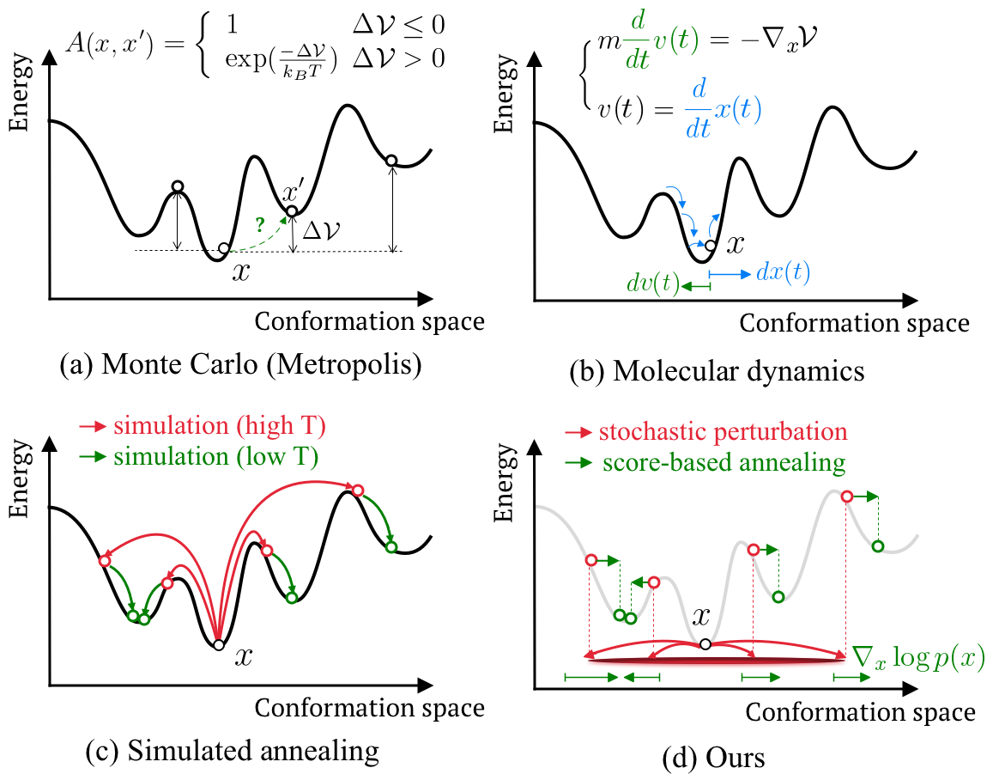

<div align="center">

# Str2Str: A Score-based Framework for Zero-shot Protein Conformation Sampling

<a href="https://pytorch.org/get-started/locally/"></a>
<a href="https://pytorchlightning.ai/"></a>
<a href="https://hydra.cc/"></a>
<a href="https://github.com/ashleve/lightning-hydra-template"></a><br>
[](https://openreview.net/forum?id=C4BikKsgmK)
[](https://iclr.cc/Conferences/2024)

</div>


## 📜 Description

Str2Str is a score-based framework (which means it accommodate any diffusion/flow matching architecture) for protein conformation sampling in a zero-shot manner. The idea behind is very straightforward: given an input protein structure, which can be obtained from your favorite folding module, such as [AlphaFold](https://www.nature.com/articles/s41586-021-03819-2) or [ESMFold](https://www.science.org/doi/10.1126/science.ade2574), Str2Str perturbs the structure in the corresponding geometric space, followed by a sequence of denoising steps.  

<p align="center">

</p>

This simply yet effective sampling pipeline draws abundant inspiration from traditional methods to sample conformations, yet it is guided by a (learned) neural score network.


<p align="center">

</p>


## 🚀 Installation
```sh
git clone https://github.com/lujiarui/Str2Str.git
cd Str2Str

# Create conda environment.
conda env create -f environment.yml
conda activate myenv

# Support import as a package.
pip install -e .
```

## 🧪 Download and process PDB data

```sh
# Edit this accordingly.
DOWNLOAD_DIR=/path/to/download/directory
PROCESSED_DIR=/path/to/processing/directory

# Download.
bash scripts/pdb/download_pdb_mmcif.sh $DOWNLOAD_DIR

# Preprocess.
python scripts/pdb/preprocess.py --mmcif_dir $DOWNLOAD_DIR/pdb_mmcif/mmcif_files --output_dir $PROCESSED_DIR
```

The processed directory will be like:
```
/path/to/processing/directory
├── 00
│   └── 200l.pkl
├── 01
│   ├── 101m.pkl
│   └── 201l.pkl
├── 02
│   ├── 102l.pkl
│   └── 102m.pkl
├── 03
│   ├── 103l.pkl
│   └── 103m.pkl
└── <a metadata file>.csv
```

(Optional) To tailor the training set, a subset of proteins can be specified to to the `preprocess.py`, such as the culled list from [PISCES](https://dunbrack.fccc.edu/pisces/). To enable this, simply download the target list and add flag `--pisces`:
```sh
PISCES_FILE=/path/to/pisces/file

python scripts/pdb/preprocess.py --mmcif_dir $DOWNLOAD_DIR/pdb_mmcif/mmcif_files --output_dir $PROCESSED_DIR --pisces $PISCES_FILE
```


## 🔨 How to Run

First thing first, the path to train / test data should be configured right. Simply rename `.env.example` -> `.env` and specify the top three environment variables.

#### Training
```sh
# Training w/ default configs.
python src/train.py

# w/ single GPU.
python src/train.py trainer=gpu

# w/ DDP on 2 GPUS. 
python src/train.py trainer=ddp trainer.devices=2 data.batch_size=4

# w/ the chosen experiment configuration.
python src/train.py experiment=example trainer.devices=2 data.batch_size=4

# limit training epochs (100) or time (12hrs)
python src/train.py +trainer.max_epochs=100
python src/train.py +trainer.max_time="00:12:00:00"
```

#### Inference

To perform inference, a trained model checkpoint is required and can be specified using `ckpt_path=/path/to/checkpoint`. A pretrained PyTorch checkpoint can be accessed from [Google Drive](https://drive.google.com/file/d/1-qr2kXbmSoV5mPm7-6Fg6Rq9GPr74wLA/view?usp=drive_link). Download and put it into `data/ckpt`. 

```sh
# inference (sampling & evaluation on metrics)
python src/eval.py task_name=inference

# inference (if you want to load checkpoint elsewhere)
python src/eval.py task_name=inference ckpt_path=/path/to/some/checkpoint

# sampling only (skip evaluation)
python src/eval.py task_name=inference target_dir=null

# evaluation only (skip sampling)
python src/eval.py task_name=eval_only pred_dir=/path/to/some/pdb/directory
```

To run evaluation, you may need to specify the `REFERENCE_DATA` variable in the `.env` file. This path (points to a directory) should contain the reference trajectory/ensembles, one `.pdb` file per target, aligned with the directory arch like `TEST_DATA`. In the paper, the long MD trajectories from the study in [Science.1208351](https://www.science.org/doi/abs/10.1126/science.1208351) are used as reference.

## 🍪 Tools

We also provide several useful scripts based on existing tools, which can be helpful along with Str2Str.

To run MD simulation using [OpenMM](https://github.com/openmm/openmm):
```bash
python script/simulate.py --pdb_dir /path/to/some/pdb/directory --output_dir /path/to/output/directory
```

To fold (sequence -> structure) using [ESMFold](https://github.com/facebookresearch/esm).
```bash
python script/fold.py -i /path/to/some/fasta/or/pdb/directory -o /path/to/output/directory
```

To pack (backbone atoms -> full heavy atoms) using [FASPR](https://github.com/tommyhuangthu/FASPR).
```bash
python script/pack.py -i /path/to/some/pdb/directory -o /path/to/output/directory --n_cpu 4
```


## 📧 Contact

- jiaruilu27[at]gmail[dot]com


## 📝 Cite Str2Str

TBC..


*!! Oops, this repo is still under construction, please be patient when we are making it complete at top speed.* 🥰
